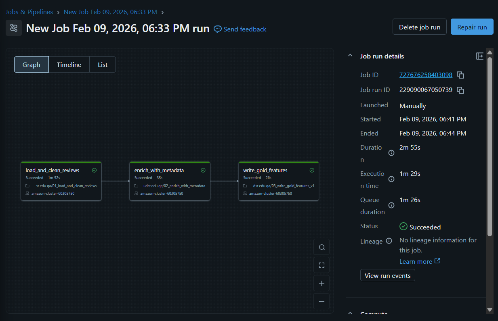
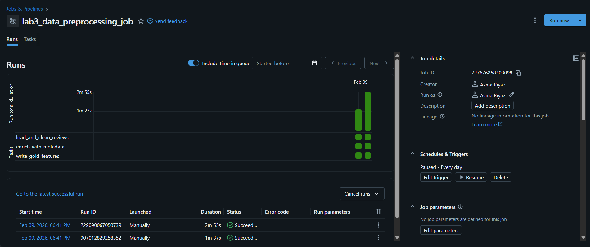

# 🧪 Lab 3 — Data Preprocessing on Azure (Databricks Lakehouse)

**Course:** DSAI3202 — Cloud Computing (Winter 2026)
**Student:** Subject One
**Lab:** 3 — Data Preprocessing in Azure

---

## 📌 Overview

This lab implements an end-to-end **data preprocessing pipeline** on **Azure Databricks** using **Apache Spark**, following the **Lakehouse / Medallion architecture**. The pipeline cleans, enriches, curates, and orchestrates Amazon Electronics review data from raw ingestion to an analytics- and ML-ready Gold dataset.

---

## 🏗️ Architecture

### Medallion (Lakehouse) Layers

* **Bronze (raw):** Original JSON files ingested into Azure Data Lake Storage Gen2
* **Silver (processed):** Cleaned and enriched Parquet datasets
* **Gold (curated):** Feature-engineered dataset ready for analytics and ML

### Tools & Technologies

* **Azure Databricks:** Managed Apache Spark environment
* **Apache Spark (PySpark):** Distributed data processing
* **Azure Data Lake Storage Gen2 (ADLS):** Scalable cloud storage
* **Parquet:** Columnar storage format for performance
* **Databricks Jobs:** Pipeline orchestration

---

## 📂 Repository Structure

```
.
├── 01_load_and_clean_reviews.ipynb
├── 02_enrich_with_metadata.ipynb
├── 03_write_gold_features_v1.ipynb
└── README.md
```

---

## 🔁 ETL Pipeline Mapping

| ETL Stage | Notebook                    | Description                                  |
| --------- | --------------------------- | -------------------------------------------- |
| Extract   | `01_load_and_clean_reviews` | Load Parquet reviews from Silver layer       |
| Transform | `01_load_and_clean_reviews` | Validate fields, clean text, enforce ratings |
| Transform | `02_enrich_with_metadata`   | Join reviews with product metadata           |
| Load      | `03_write_gold_features_v1` | Write curated Gold dataset                   |

---

## 📘 Notebook Details

### 1️⃣ Load & Clean Reviews (`01_load_and_clean_reviews.ipynb`)

**Purpose:** Validate and clean review data stored in Parquet format.

**Key Operations:**

* Connect Databricks to ADLS Gen2 using storage account key
* Load reviews from `processed/reviews/`
* Drop rows with missing critical fields (`asin`, `reviewerID`, `overall`)
* Enforce rating bounds (1–5)
* Clean review text (trim + minimum length)
* Write cleaned data to `processed/clean_reviews/`

---

### 2️⃣ Enrich with Metadata (`02_enrich_with_metadata.ipynb`)

**Purpose:** Enrich cleaned reviews with product-level information.

**Key Operations:**

* Load cleaned reviews from Silver layer
* Load raw product metadata (JSON) from Bronze layer
* Select relevant metadata fields (`asin`, `title`, `brand`, `price`)
* Perform left join on `asin`
* Write enriched dataset to `processed/enriched_reviews/`

---

### 3️⃣ Write Gold Dataset (`03_write_gold_features_v1.ipynb`)

**Purpose:** Create an intermediate curated dataset for analytics and ML.

**Selected Features:**

* Product: `asin`, `title`, `brand`, `price`
* Review: `reviewerID`, `overall`, `summary`, `reviewText`, `helpful`
* Time: `reviewTime`, `review_year`

**Output:**

* Parquet dataset written to `curated/features_v1/`

---

## ⚙️ Pipeline Orchestration (Databricks Jobs)

The three notebooks are orchestrated using a **Databricks Job** to ensure sequential execution:

1. `load_and_clean_reviews`
2. `enrich_with_metadata` (depends on step 1)
3. `write_gold_features_v1` (depends on step 2)

This mirrors real-world production data pipelines and supports manual or scheduled execution.

---

## ✅ Results

* Successfully processed Amazon Electronics reviews end-to-end
* Implemented a clean **Bronze → Silver → Gold** flow
* Generated an analytics-ready Gold dataset in Parquet format

---

## Screenshots




---

## 💡 Future Improvements

* Additional enrichments (e.g., sentiment scores, review length features)
* Convert Parquet to **Delta Lake** for versioning and ACID guarantees
* Add data quality checks and monitoring
* Build dashboards and ML pipelines on top of the Gold layer

---

## 📎 Submission

* All Databricks notebooks committed to GitHub
* This README documents architecture, code, and design decisions
* GitHub repository URL submitted as required